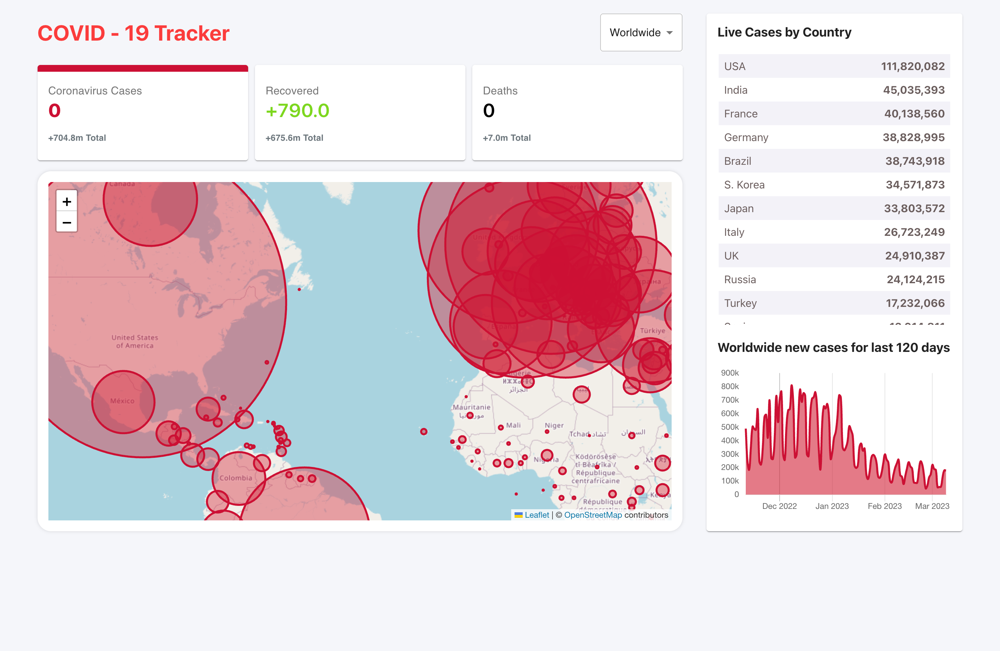
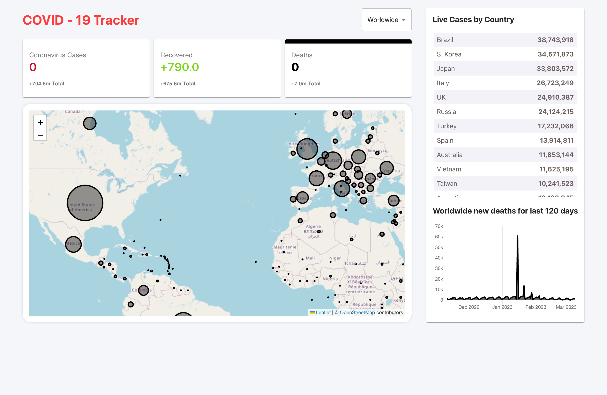

# COVID-19 Statistics

<div align="center">

[](https://react.dev/)
[](https://create-react-app.dev/)
[](https://v4.mui.com/)
[](https://leafletjs.com/)
[](https://www.chartjs.org/)
[](https://nodejs.org/)

</div>

## Overview

Interactive COVID‑19 tracker dashboard showing global and country‑level statistics. Features live case counts, a choropleth map, and historical trends using public data from `disease.sh`.

## Key Features

- Global and per‑country stats with quick country selector
- Interactive Leaflet map with case density visualization
- Historical line charts for cases, recoveries, and deaths

## Tech Stack

React 17, Create React App 4, Material‑UI v4, Leaflet, Chart.js, Numeral.js

## Architecture

SPA built with CRA. Data fetched from `disease.sh` REST endpoints. State managed with React hooks across components: `InfoBox`, `Map`, `Table`, `LineGraph`.

## Performance & Accessibility

CRA optimizations and React 17 rendering; semantic HTML and keyboard‑navigable controls where applicable.

## Quality

- Linting: react-app ESLint • Formatting: N/A
- Type safety: N/A (JavaScript)
- Tests: CRA defaults (Jest + React Testing Library)
- CI: none

## Prerequisites

- Node.js: `18.20.3`

## Installation

```bash
git clone https://github.com/maxgalchenko/covid-19-statistics.git
cd covid-19-statistics
npm install
```

## Quick Start

```bash
npm start
# Production
npm run build
```

Open http://localhost:3000

## Available Scripts

- `npm start` – Run the development server at http://localhost:3000
- `npm run build` – Create an optimized production build in `build/`
- `npm test` – Run tests in watch mode (Jest + RTL via CRA)
- `npm run eject` – Eject CRA configuration (one‑way operation)

## Screenshots





---

<div align="center">

Built with ❤️ by [Maksym Galchenko](https://github.com/maxgalchenko)

[](https://www.linkedin.com/in/galchenko-max/)
[](https://portfolio-green-six-29.vercel.app/)
[](mailto:galchenko.maksym@gmail.com)


</div>
